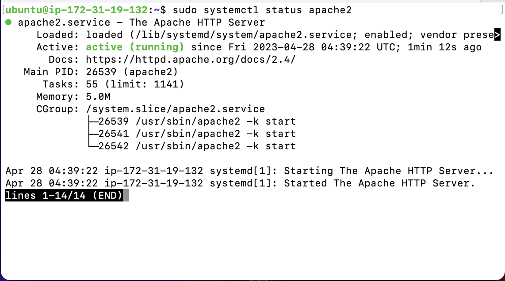
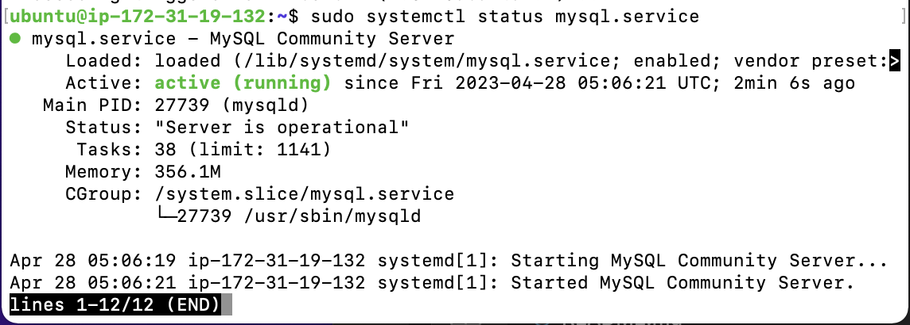
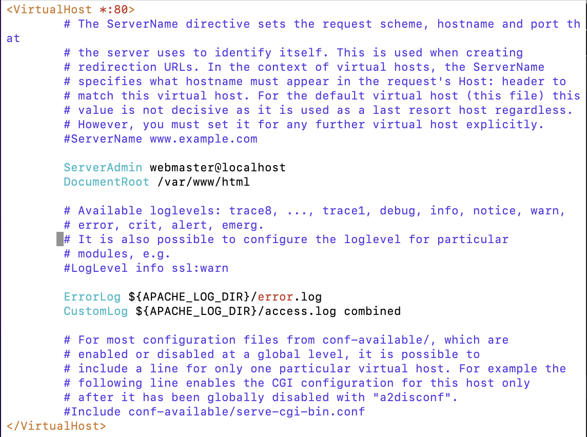
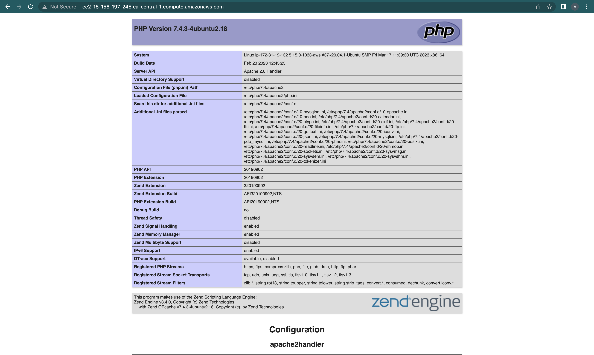

# <b>Steps taken for the project</b>

## <b>1. Launching a Linux Instance On AWS:</b>

This step requires launching an EC2 instance (an Ubuntu Linux machine) to serve as the virtual machine for the web application to be set up. 

Before that, I created a Security Group that allowed All traffic from everywhere on the internet. 


After launching the instance on AWS, I connected to it from my terminal through SSH client.


## <b>2. Installing Apache Web Server:</b>

First, on the Ubuntu server, to update and upgrade the list of packages in the apt package manager, use this commands:

```
sudo apt update && sudo apt upgrade -y
```

And to install Apache:

```
sudo apt install apache2 -y
```

To check Apache server's status:

```
sudo systemctl status apache2
```



To test the server setup, on the terminal, do:

```
curl http://localhost

#or

curl http://locaalhost:80
# To open port 80

#or

curl http://127.0.0.1:80
```

This will return an Apache HTML file. However, to see a more graphical display, on the web browser, copy and paste the public IP of the  instance and press enter. It should render a webpage like this:


<br>

## <b>3. Installing MySQL:</b>

To install the MySQL server on the Webserver itself, use the following commands, I will follow this [article](https://funmifagoyinbo.hashnode.dev/how-to-set-up-a-mysql-server-on-ubuntu-2004) to set it up:

```
sudo apt install mysql-server -y

#To check status
sudo systemctl status mysql.service
 
#To check MySQL version
mysql --version
```




<br>

## <b>4. Installing PHP:</b>

PHP is the component in our setup that will process codes to display the dynamic contents to the end users. For PHP to render the codes, we will also install some other dependencies asides the PHP package. They are;

 <b>1. php-mysql-</b> a PHP module that allows PHP to communicate with MySQL-based databases.

 <b>2. libapache2-mod-php-</b> allows Apache to handle PHP files.

 ```
 sudo apt install php libapache2-mod-php php-mysql -y


 php -v
 ```


<br>

## <b>5. Creating A Virtual Host for A Website using Apache:</b>

Here, we will set up a domain called `projectLAMP`. VirtualHost configuration means we are telling Apache to serve projectLAMP using `/var/www/projectLAMP` as its web root directory.

On the Ubuntu server we created, Apache has a server block that is enabled by default and is configured to serve documents from the `/var/www/html` directory. To view this file, we will use this command:

```
sudo vi /etc/apache2/sites-available/000-default.conf
```



Also, by default, the root directory would use the `index.html` file located in the root directory as its main/landing page.

However, We will not touch the default setting, but will create our custom settings in the same `/var/www/` directory. To set this new one up, we will create another directory with the following commands:

```
sudo mkdir /var/www/projectLAMP
```

The next thing is to assign ownership of the directory to the user as shown below:

```
sudo chown -R $USER:$USER /var/www/projectLAMP
```

Then, create and open a new configuration file in Apache’s `sites-available directory`. I'll be using vim editor to do that:

```
sudo vi /etc/apache2/sites-available/projectLAMP.conf
```

I'll be adding the folllowing lines of code in the blank page that opens up:

```
<VirtualHost *:80>
    ServerName projectLAMP
    ServerAlias www.projectLAMP 
    ServerAdmin webmaster@localhost
    DocumentRoot /var/www/projectLAMP
    ErrorLog ${APACHE_LOG_DIR}/error.log
    CustomLog ${APACHE_LOG_DIR}/access.log combined
</VirtualHost>
```

A quick glance at the contents of the ` /etc/apache2/sites-available` directory gives this:

```
sudo ls /etc/apache2/sites-available
```


Note that when you comment out the ServerName and ServerAlias code lines in the VirtualHost config file, it means that you don't want a domain name for the website.

The next step is to use the `a2ensite` command to enable the new virtualhost as below:

```
sudo a2ensite projectLAMP
```

Since we are not interested in using the default homepage that Apache displayed when we installed it as our landing page, we need to disable the default config. To achieve this, we will use the following command:

```
sudo a2dissite 000-default
```
To make sure the configuration file does not contain any error, use the command below:

```
sudo apache2ctl configtest
```

Finally, to enable all the configurations we have set, use the following command:

```
sudo systemctl reload apache2
```

Recall that the default setting had an `index.html` file it worked with. Since we are customizing our configuration, we need to create or add our own index.html file to be rendered. 

To keep things simple, we can do this:

```
sudo echo '<h1>Hello LAMP from hostname</h1>' > /var/www/projectLAMP/index.html
```
Since we have not mapped our domain name to the IP address, we will still keep using the IP address to test our website. Using the IP address in the web browser rendered the new index file as the default landing page as shown below:


However, we can also use the `public-IPv4-DNS` (which can be found in the details section of the ec2 instance on the AWS management console) to access our site. It should also display the same image as below: 


 <br>

 ## <b>6. Enable PHP on the website:</b>

One of the default settings in Apache allows it take precedence in rendering an `index.html` file over an `index.php` file. This is found in the DirectoryIndex settings on Apache's `/etc/apache2/mods-enabled/dir.conf` file.

A practical use case is in setting up maintenance pages in PHP applications by creating a temporary index.html file containing an informative message to visitors.

Because this page will take precedence over the `index.php` page, it will become the landing page for the application temporarily. Once maintenance is over, the `index.html` is renamed or removed from the document root, bringing back the regular application page.

To change this behavior, we'll need to edit the `/etc/apache2/mods-enabled/dir.conf` file and change the order in which the `index.php` file is listed within the DirectoryIndex directive:

```
sudo vim /etc/apache2/mods-enabled/dir.conf
```

```
<IfModule mod_dir.c>
        #Change this:
        #DirectoryIndex index.html index.cgi index.pl index.php index.xhtml index.htm
        #To this:
        DirectoryIndex index.php index.html index.cgi index.pl index.xhtml index.htm
</IfModule>
```

Save the file and Reload Apache to effect the changes.

```
sudo systemctl reload apache2
```

Having set up our custom location to host our website's files and folders, we will create an `index.php` script to help us test our config. This configuration means that Apache would be able to handle and process requests sent to the PHP server.

First, we will create a file named `index.php` in our root directory as shown:

```
vim /var/www/projectLAMP/index.php
```

In the editor, add these code lines and save:

```
<?php
phpinfo();
```

When you refresh the page, you should have this:



The PHP page rendered gives information about your server from the perspective of PHP. It is useful for debugging and to ensure that your settings are being applied correctly.

If you can see this page in your browser, then your PHP installation is working as expected.

After checking the relevant information about your PHP server through that page, it’s best to remove the file you created as it contains sensitive information about your PHP environment -and your Ubuntu server. You can use rm to do so:

```
sudo rm /var/www/projectlamp/index.php
```

After setting this up, you can go ahead to destroy the EC2 instance.

However, if you are using a free-tier instance, you can stop the EC2 instance. This is because you have access to 750 hours (31.25 days) of t2.micro server per month for the first 12 months FOR FREE. When you stop an instance – it stops consuming available hours.

You can launch and stop new instances when you need to, but by default, there is a soft-limit of maximum 5 running instances at the same time. 

Please, Note that every time you stop and start your EC2 instance – you will have a new IP address, it is a normal behavior, so do not forget to update your SSH credentials when you try to connect to your EC2 server.
