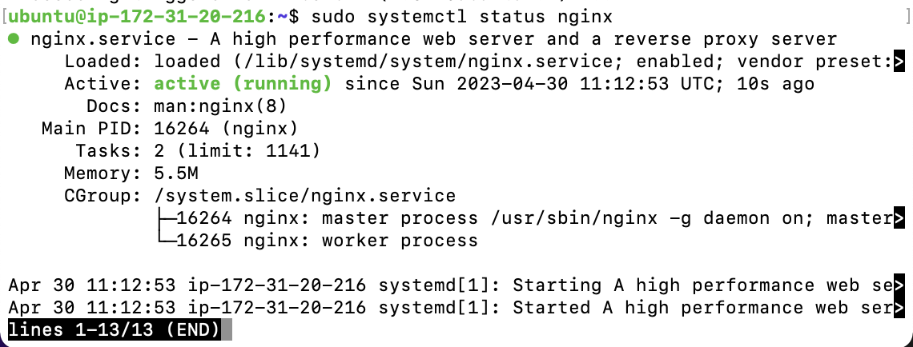
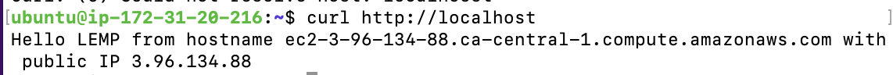

# <b>Steps taken for the project's implementation</b>

## <b>1. Launching a Linux Instance On AWS:</b>
Since this project is similar to project one, we will kickstart by setting up an AWS EC2 instance with an Ubuntu machine and SSH into it from the terminal.

<br>

## <b>2. Installing the Nginx Web Server:</b>

We will then update the apt package manager, install Nginx, and check it's status with the following commands:

```
sudo apt update && sudo apt upgrade -y
sudo apt install nginx -y
sudo systemctl status nginx
```



The `curl http://localhost` command on the terminal gave this:


On the web browser, the IP of the server gave this webpage:


Note:
The process of converting a DNS name to IP address is called "resolution", hence, we can either use:

```
curl http://localhost:80
or
curl http://127.0.0.1:80
```

<br>

## <b>3. Installing MySQL:</b>

After setting up the web server, the next thing is the installation of a Database Management System to help us store and manage our data.

```
sudo apt install mysql-server -y

sudo mysql
```

In configuring MySQL, it is recommended that you run a security script that comes pre-installed with it. This script will remove some insecure default settings and lock down access to the DB system. However, before running the script, you will set a password for the root user, using mysql_native_password as default authentication method. You will define the user’s password with something you won't forget easily in the `myPassword` placeholder in the code below:

```
ALTER USER 'root'@'localhost' IDENTIFIED WITH mysql_native_password BY 'myPassWord';
```
You will get a notification status of `OK` and proceed to exit the MySQL terminal with:

```
exit
```

Then start running the script with the following command:

```
sudo mysql_secure_installation
```

The section will start by asking if you will like to Validate your password plugin, to keep things simple, I picked `n` for `No`. It also asked if I wanted to change the password for root and the I picked `no`:

```
Securing the MySQL server deployment.

Enter password for user root: 

VALIDATE PASSWORD COMPONENT can be used to test passwords
and improve security. It checks the strength of password
and allows the users to set only those passwords which are
secure enough. Would you like to setup VALIDATE PASSWORD component?

Press y|Y for Yes, any other key for No: n
Using existing password for root.
Change the password for root ? ((Press y|Y for Yes, any other key for No) : n

 ... skipping.
```

After this two prompts, answer all other ones with `y` for `yes` as shown below:

```
By default, a MySQL installation has an anonymous user,
allowing anyone to log into MySQL without having to have
a user account created for them. This is intended only for
testing, and to make the installation go a bit smoother.
You should remove them before moving into a production
environment.

Remove anonymous users? (Press y|Y for Yes, any other key for No) : y
Success.


Normally, root should only be allowed to connect from
'localhost'. This ensures that someone cannot guess at
the root password from the network.

Disallow root login remotely? (Press y|Y for Yes, any other key for No) : y
Success.

By default, MySQL comes with a database named 'test' that
anyone can access. This is also intended only for testing,
and should be removed before moving into a production
environment.

Remove test database and access to it? (Press y|Y for Yes, any other key for No) : y
 - Dropping test database...
Success.

 - Removing privileges on test database...
Success.

Reloading the privilege tables will ensure that all changes
made so far will take effect immediately.

Reload privilege tables now? (Press y|Y for Yes, any other key for No) : y
Success.

All done! 
```
Now, to log into the MySQL terminal, you will use this new command because you now have to use the root user's password:

```
mysql -u root -p
```
 You will be prompted for the password, so you should enter the password for the root user.

Type the following command to exit the MySQL console:

```
exit
```

However, you can change the behavior by changing the login method with the command on the terminal so that you can return to using `sudo mysql` for logging in:

```
ALTER USER 'root'@'localhost' IDENTIFIED WITH auth_socket;
```

Then, exit.

And for increased security, it’s best to have dedicated user accounts with less expansive privileges set up for every database, especially if you plan on having multiple databases hosted on your server.

<br>

## <b>4. Installing PHP:</b>

The next step is the installation of PHP for processing codes and generating dynamic contents for the web server. 


To install PHP for Nginx, we use the `php-fpm` library. `PHP-FPM` is a service that spawns new PHP processes when needed, usually through a fast-cgi module like nginx. 

A common mistake is to install the PHP package and not the `PHP-FPM` package. The problem with this approach is that unlike PHP-FPM, the PHP package installs the Apache HTTP server and its httpd process, which conflicts with Nginx. 

You will need to install `php-fpm`, which stands for <b>`PHP fastCGI Process Manager`</b>, and tell Nginx to pass PHP requests to this software for processing. Additionally, you’ll need `php-mysql`, a PHP module that allows PHP to communicate with MySQL-based databases. Core PHP packages will automatically be installed as dependencies.

Install the two packages with this command:

```
sudo apt install php-fpm php-mysql -y
```
`php -v` will give you info about the version that was installed.


## <b>CONFIGURING NGINX TO USE PHP</b>

With the installation of php and nginx in place, we need to configure php-fpm to handle requests that have a `.php` extension.


We will open the default nginx file to edit as follows:

```
sudo nano /etc/nginx/sites-available/default
```
The following edits will be made to the file:
1. Add `index.php` to the index list.
2. Uncomment the php scripts to fastCGI entry block.
3. Uncomment the line to include `snippets/fastcgi-php.conf.`
4. Uncomment the line to enable the fastcgi_pass and the php8.1-fpm. sock.
5. Uncomment the section to deny all access to Apache .htaccess files.

```
server {
  # Example PHP Nginx FPM config file
  listen 80 default_server;
  listen [::]:80 default_server;
  root /var/www/html;

  # Add index.php to setup Nginx, PHP & PHP-FPM config
  index index.php index.html index.htm index.nginx-debian.html;

  server_name _;

  location / {
    try_files $uri $uri/ =404;
  }

  # pass PHP scripts on Nginx to FastCGI (PHP-FPM) server
  location ~ \.php$ {
    include snippets/fastcgi-php.conf;

    # Nginx php-fpm sock config:
    fastcgi_pass unix:/run/php/php8.1-fpm.sock;
    # Nginx php-cgi config :
    # Nginx PHP fastcgi_pass 127.0.0.1:9000;
  }

  # deny access to Apache .htaccess on Nginx with PHP, 
  # if Apache and Nginx document roots concur
  location ~ /\.ht {
    deny all;
  }
} # End of PHP FPM Nginx config example
```

You can test your configuration for syntax errors by typing:

```
sudo nginx -t
```

This will give you an output like this:

```
nginx: the configuration file /etc/nginx/nginx.conf syntax is ok
nginx: configuration file /etc/nginx/nginx.conf test is successful
```

Then, restart Nginx to apply the changes:

```
sudo systemctl restart nginx
```

Change the root folder permission as follows:

``` 
sudo chmod -R 777 /var/www/html
```

At this point, the website is now active. So, we will remove the default `.html` that renders the `Welcome to Nginx` message, which is `index.nginx-debian.html` with this command:

```
sudo rm /var/www/html/index.nginx-debian.html
```

Then, create an `index.html` file in that location so that we can test that the server block works as expected:

```
sudo echo 'Hello LEMP from hostname' $(curl -s http://169.254.169.254/latest/meta-data/public-hostname) 'with public IP' $(curl -s http://169.254.169.254/latest/meta-data/public-ipv4) >> /var/www/html/index.html
```

On the terminal, `curl http://localhost` gave:



On the browser, we have this:


If you see the text from the `echo` command you wrote to your `index.html` file, then it means your Nginx site is working as expected. In the output, you will see your server’s public hostname (DNS name) and public IP address. 

You can also access your website in your browser by public DNS name, not only by IP- the result must be the same (port is optional).

## <b>The Index Block Explained </b> 

You can leave this file in place as a temporary landing page for your application until you set up an `index.php` file to replace it. Once you do that, the `index.php` file will be rendered as the root file since we wrote it before `index.html` in the index block  of the config file previously.

However, if `index.html` comes before `index.php` in the index block, remember to remove or rename the `index.html` file from your document root directory, as it would take precedence over an `index.php` file by default.


## <b>Testing PHP with Nginx</b>

Your LEMP stack is now fully configured, however, in this next step, we will create a PHP script to test that Nginx is in fact able to handle PHP files within your configured website.

This can be achieved by creating a test PHP file in the document root. 

1. Open a new file called `index.php` within your document root in your text editor:

```
sudo nano /var/www/html/index.php
```

Type or paste the following lines into the new file. This is a valid PHP code that will return information about your server:

```
<?php
phpinfo();
```

You can now access this page in your web browser by visiting the domain name or public IP address you’ve set up in your Nginx configuration file. And since `index.php` comes before the index.html file, it will output the php information about your server.

After checking the relevant information about your PHP server through that page, it’s best to remove the file you created as it contains sensitive information about your PHP environment and your Ubuntu server. You can use rm to remove that file:

```
sudo rm /var/www/html/index.php
```

You can always regenerate this file if you need it later.

Note that for your root document to display anything on the browser, you need to have a file with the `index` keyword. This can then have any other extension that was specified in the index block. If none of the files in the directory does not have `index.`, the website domain will give `403 forbidden` error as shown:


