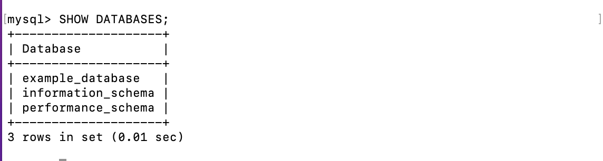
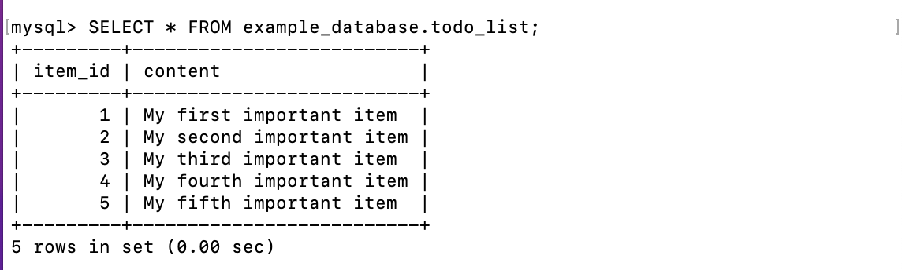
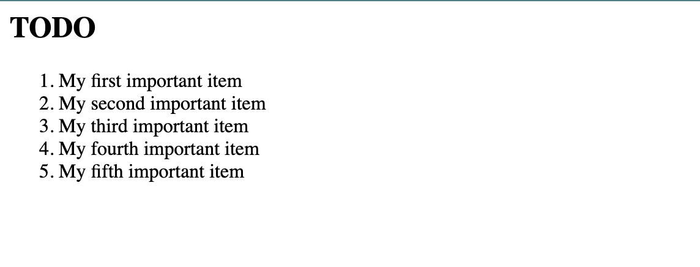

# <b>Retrieving Data from MySQL DB with PHP</b> 

## <b>Create Database, User, Password, and Data</b>

In this step you will create a test database (DB) with simple "To do list" and configure access to it, so the Nginx website would be able to query data from the DB and display it.

At the time of this writing, the native MySQL PHP library, `mysqlnd` doesn’t support caching_sha2_authentication, the default authentication method for MySQL 8. We’ll need to create a new user with the `mysql_native_password` authentication method in order to be able to connect to the MySQL database from PHP.

Connect to the MySQL console with:

```
sudo mysql
```

We  will create a database, a user, and the password with the following commands:

1. Create a DB:
   
   ```
   CREATE DATABASE `example_database`;
   ```

2. Create a user with password: 
   
   ```
   CREATE USER 'example_user'@'%' IDENTIFIED WITH mysql_native_password BY 'password';
   ```

3. Grant full privileges on the newly created DB:
   
   ```
   GRANT ALL ON example_database.* TO 'example_user'@'%';
   ```

This will give the `example_user` user full privileges over the `example_database` database, while preventing this user from creating or modifying other databases on your server.

4. Exit the console by typing `exit`.

You can test if the new user has the proper permissions by logging in to the MySQL console again, this time using the custom user credentials:

```
mysql -u example_user -p
```

This command will prompt you for the password of the user you created previously and you will have access to the MySQL console again.

From the terminal, to confirm that you have access to the example_database DB, type:

```
SHOW DATABASES;
```



Next, we’ll create a test table named `todo_list`. From the MySQL console, run the following statement:

```
CREATE TABLE example_database.todo_list (
mysql>     item_id INT AUTO_INCREMENT,
mysql>     content VARCHAR(255),
mysql>     PRIMARY KEY(item_id)
mysql> );
```

Insert this commands to populate the data:

```
INSERT INTO example_database.todo_list (content) VALUES ("My first important item");
```
To confirm that the data was successfully saved to your table, run:

```
SELECT * FROM example_database.todo_list;
```
Insert more rows of content in the test table by repeating the next command a few times, using different VALUES as follows:

```
INSERT INTO example_database.todo_list (content) VALUES ("My second important item");
```

After checking the data in the table, I have the following image:



After confirming that you have valid data in your test table, you can exit the MySQL console:

```
exit
```

## <b>Create PHP script to query DB</b>

Now you can create a PHP script that will connect to MySQL and query for your content. This will be achieved by the creation of a new PHP file in your custom web root directory using your preferred editor. We’ll use nano editor for that:

```
nano /var/www/html/todo_list.php
```

Copy this content into your todo_list.php script:

```
<?php
$user = "example_user";
$password = "password";
$database = "example_database";
$table = "todo_list";

try {
  $db = new PDO("mysql:host=localhost;dbname=$database", $user, $password);
  echo "<h2>TODO</h2><ol>";
  foreach($db->query("SELECT content FROM $table") as $row) {
    echo "<li>" . $row['content'] . "</li>";
  }
  echo "</ol>";
} catch (PDOException $e) {
    print "Error!: " . $e->getMessage() . "<br/>";
    die();
}
```

The following PHP script connects to the MySQL database and queries for the content of the todo_list table, displays the results in a list. If there is a problem with the database connection, it will throw an exception.

After you have saved and closed the editor, you can now access this page in your web browser by visiting the domain name or public IP address configured for your website, followed by /todo_list.php:

```
http://<Public_domain_or_IP>/todo_list.php
```

You should see a page like this, showing the content you’ve inserted in your test table:



That means your PHP environment is ready to connect and interact with your MySQL server.

Congratulations! In this guide, we have built a flexible foundation for serving PHP websites and applications to your visitors, using Nginx as web server and MySQL as Database Management System.
