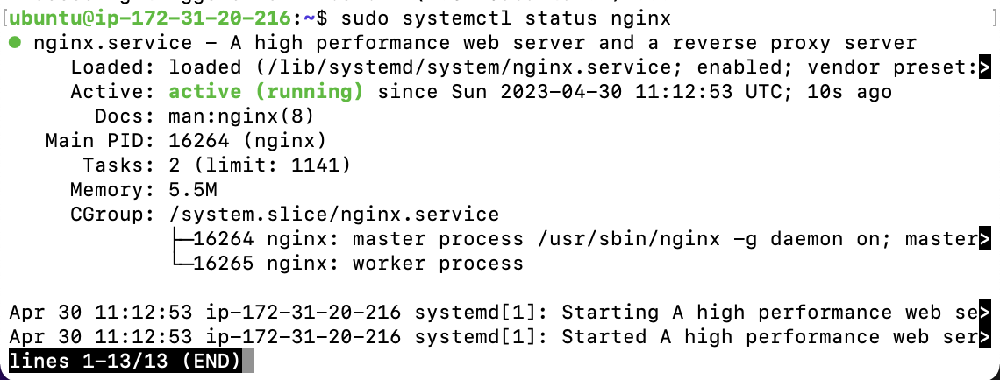
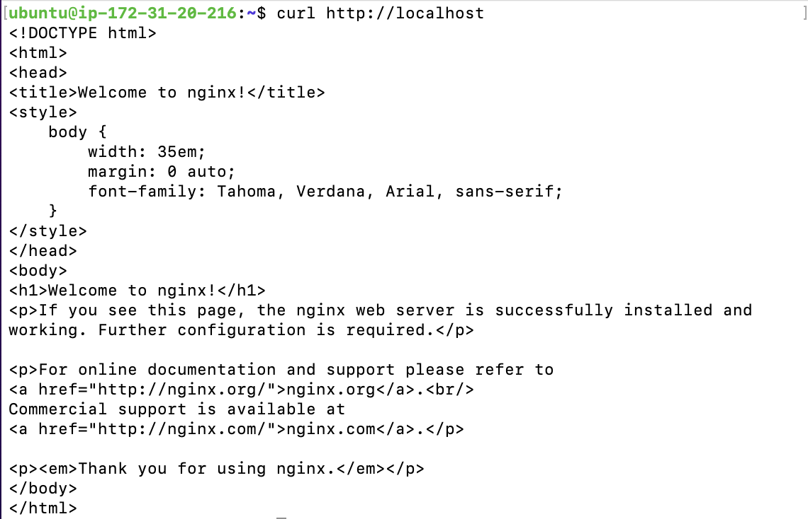
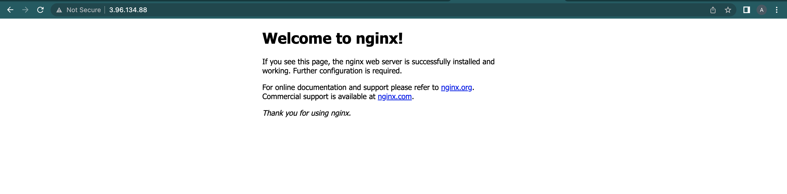
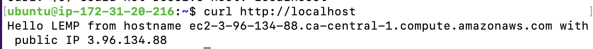
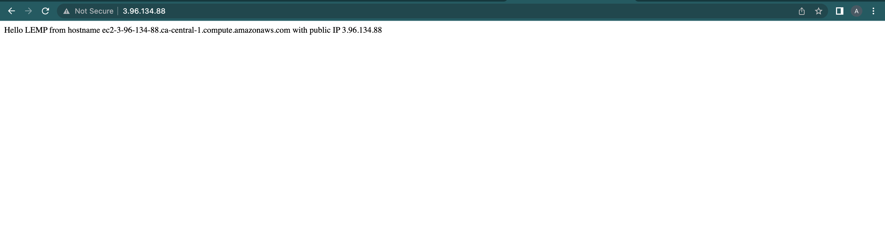

# <b>Steps taken for the project's implementation</b>

## <b>1. Launching a Linux Instance On AWS:</b>
Since this project is similar to project one, we will kickstart by setting up an AWS EC2 instance with an Ubuntu machine and SSH into it from the terminal.

<br>

## <b>2. Installing the Nginx Web Server:</b>

We will then update the apt package manager, install Nginx, and check it's status with the followinng commands:

```
sudo apt update && sudo apt upgrade -y
sudo apt install nginx -y
sudo systemctl status nginx
```



The `curl http://localhost` command on the terminal gave this:



On the web browser, the IP of the server gave this webpage:



Note:
The process of converting a DNS name to IP address is called "resolution", hence, we can either use:

```
curl http://localhost:80
or
curl http://127.0.0.1:80
```

<br>

## <b>3. Installing MySQL:</b>

After setting up the web server, the next thing is the installation of a Database Management System to help us store and manage our data.

```
sudo apt install mysql-server -y

sudo mysql
```

In configuring MySQl, it is recommended that you run a security script that comes pre-installed with it. This script will remove some insecure default settings and lock down access to the DB system. However, before running the script, you will set a password for the root user, using mysql_native_password as default authentication method. You will define the user’s password with something you won't forget easily in the `myPassword` placeholder in the code below:

```
ALTER USER 'root'@'localhost' IDENTIFIED WITH mysql_native_password BY 'myPassWord';
```
You will get a notification status of `OK` and proceed to exit the MySQL terminal with:

```
exit
```

Then start running the script with the following command:

```
sudo mysql_secure_installation
```

The section will start by asking if you will like to Validate your password plugin, to keep things simple, I picked `n` for `No`. It also asked if I wanted to change the password for root and the I picked `no`:

```
Securing the MySQL server deployment.

Enter password for user root: 

VALIDATE PASSWORD COMPONENT can be used to test passwords
and improve security. It checks the strength of password
and allows the users to set only those passwords which are
secure enough. Would you like to setup VALIDATE PASSWORD component?

Press y|Y for Yes, any other key for No: n
Using existing password for root.
Change the password for root ? ((Press y|Y for Yes, any other key for No) : n

 ... skipping.
```

After this two prompts, answer all other ones with `y` for `yes` as shown below:

```
By default, a MySQL installation has an anonymous user,
allowing anyone to log into MySQL without having to have
a user account created for them. This is intended only for
testing, and to make the installation go a bit smoother.
You should remove them before moving into a production
environment.

Remove anonymous users? (Press y|Y for Yes, any other key for No) : y
Success.


Normally, root should only be allowed to connect from
'localhost'. This ensures that someone cannot guess at
the root password from the network.

Disallow root login remotely? (Press y|Y for Yes, any other key for No) : y
Success.

By default, MySQL comes with a database named 'test' that
anyone can access. This is also intended only for testing,
and should be removed before moving into a production
environment.

Remove test database and access to it? (Press y|Y for Yes, any other key for No) : y
 - Dropping test database...
Success.

 - Removing privileges on test database...
Success.

Reloading the privilege tables will ensure that all changes
made so far will take effect immediately.

Reload privilege tables now? (Press y|Y for Yes, any other key for No) : y
Success.

All done! 
```
Now, to log into the MySQL terminal, you will use this new commaand because you now have to use the root user's password:

```
mysql -u root -p
```
 You will be prompted for the password, so you should enter the password for the root user.

Type the following command to exit the MySQL console:

```
exit
```

However, you can change the behavior by changing the login method with the command on the terminal so that you can return to using `sudo mysql` for logging in:

```
ALTER USER 'root'@'localhost' IDENTIFIED WITH auth_socket;
```

Then, exit.

And for increased security, it’s best to have dedicated user accounts with less expansive privileges set up for every database, especially if you plan on having multiple databases hosted on your server.

<br>

## <b>4. Installing PHP:</b>

The next step is the installation of PHP for processing codes and generating dynamic contents for the web server.

While Apache embeds the PHP interpreter in each request, Nginx requires an external program to handle PHP processing and act as a bridge between the PHP interpreter itself and the web server. This allows for a better overall performance in most PHP-based websites, but it requires additional configuration. You will need to install `php-fpm`, which stands for <b>`PHP fastCGI Process Manager`</b>, and tell Nginx to pass PHP requests to this software for processing. Additionally, you’ll need `php-mysql`, a PHP module that allows PHP to communicate with MySQL-based databases. Core PHP packages will automatically be installed as dependencies.

Install the two packages with this command:

```
sudo apt install php-fpm php-mysql -y
```
`php -v` will give you info about the version that was installed.


## <b>CONFIGURING NGINX TO USE PHP</b>

Similar to virtual hosting in Apache, we can create server blocks in Nginx web server to encapsulate configuration details and host more than one domain on a single server.

On Ubuntu 20.04, Nginx has one server block enabled by default and is configured to serve documents out of a directory at `/var/www/html`. While this works well for a single site, it can become difficult to manage if you are hosting multiple sites. Instead of modifying `/var/www/html`, we will create a directory structure within `/var/www` for a domain called  `projectLEMP` website, leaving `/var/www/html` in place as the default directory to be served if a client request does not match any other sites.

1. Create the root web directory for projectLEMP as follows:

```
sudo mkdir /var/www/projectLEMP
```

2. Assign ownership of the directory with the `$USER` environment variable, which will reference your current system user:

```
sudo chown -R $USER:$USER /var/www/projectLEMP
```

3. Open a new configuration file in Nginx’s sites-available directory using your preferred command-line editor. Here, we’ll use nano:

```
sudo nano /etc/nginx/sites-available/projectLEMP
```

4. Paste in the following codes for its  configuration:

```
#/etc/nginx/sites-available/projectLEMP

server {
    listen 80;
    server_name projectLEMP www.projectLEMP;
    root /var/www/projectLEMP;

    index index.html index.htm index.php;

    location / {
        try_files $uri $uri/ =404;
    }

    location ~ \.php$ {
        include snippets/fastcgi-php.conf;
        fastcgi_pass unix:/var/run/php/php8.1-fpm.sock;
     }

    location ~ /\.ht {
        deny all;
    }

}
```

Here is what each of these directives and location blocks do:

<b>listen —</b> Defines what port Nginx will listen on. In this case, it will listen on port 80, the default port for HTTP.

<b>root —</b> Defines the document root where the files served by this website are stored.

<b>index —</b> Defines in which order Nginx will prioritize index files for this website. It is a common practice to list index.html files with a higher precedence than index.php files to allow for quickly setting up a maintenance landing page in PHP applications. You can adjust these settings to better suit your application needs.

<b>server_name —</b> Defines which domain names and/or IP addresses this server block should respond for. Point this directive to your server’s domain name or public IP address.

<b>location / —</b> The first location block includes a try_files directive, which checks for the existence of files or directories matching a URI request. If Nginx cannot find the appropriate resource, it will return a 404 error.

<b>location ~ .php$ —</b> This location block handles the actual PHP processing by pointing Nginx to the fastcgi-php.conf configuration file and the php7.4-fpm.sock file, which declares what socket is associated with php-fpm.

<b>location ~ /.ht —</b> The last location block deals with .htaccess files, which Nginx does not process. By adding the deny all directive, if any .htaccess files happen to find their way into the document root ,they will not be served to visitors.

5. Save and close the file by typing `CTRL+X` and then `y` and `ENTER` to confirm. Then, activate your configuration by linking to the config file from Nginx’s sites-enabled directory:

```
sudo ln -s /etc/nginx/sites-available/projectLEMP /etc/nginx/sites-enabled/
```

This will tell Nginx to use the configuration file the next time it is reloaded. 

You can test your configuration for syntax errors by typing:

```
sudo nginx -t
```

This will give you an output like this:

```
nginx: the configuration file /etc/nginx/nginx.conf syntax is ok
nginx: configuration file /etc/nginx/nginx.conf test is successful
```

If there are any errors, you should go back to your configuration file to review its contents before continuing.

We also need to disable default Nginx host that is currently configured to listen on port 80, for this run:

```
sudo unlink /etc/nginx/sites-enabled/default
```

Then, reload Nginx to apply the changes:

```
sudo systemctl reload nginx
```
Your new website is now active, but the web root `/var/www/projectLEMP` is still empty. Create an `index.html` file in that location so that we can test that your new server block works as expected:

```
sudo echo 'Hello LEMP from hostname' $(curl -s http://169.254.169.254/latest/meta-data/public-hostname) 'with public IP' $(curl -s http://169.254.169.254/latest/meta-data/public-ipv4) > /var/www/projectLEMP/index.html
```

On the terminal, `curl http://localhost` gave:



On the browser, we have this:



If you see the text from the `echo` command you wrote to your `index.html` file, then it means your Nginx site is working as expected. In the output, you will see your server’s public hostname (DNS name) and public IP address. 

You can also access your website in your browser by public DNS name, not only by IP- the result must be the same (port is optional).

You can leave this file in place as a temporary landing page for your application until you set up an `index.php` file to replace it. Once you do that, remember to remove or rename the `index.html` file from your document root, as it would take precedence over an `index.php` file by default.


## <b>Testing PHP with Nginx</b>
Your LEMP stack is now fully configured, however, in this next step, we will create a PHP script to test that Nginx is in fact able to handle. PHP files within your newly configured website.

This can be achieved by creating a test PHP file in the document root. 

1. Open a new file called `info.php` within your document root in your text editor:

```
sudo nano /var/www/projectLEMP/info.php
```

Type or paste the following lines into the new file. This is a valid PHP code that will return information about your server:

```
<?php
phpinfo();
```

You can now access this page in your web browser by visiting the domain name or public IP address you’ve set up in your Nginx configuration file, followed by `/info.php`:

