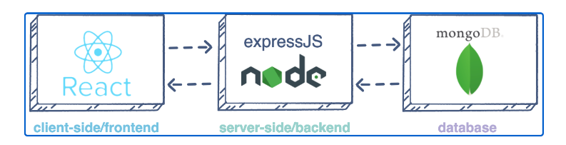

# <b>Project 3- SIMPLE TO-DO APPLICATION ON MERN WEB STACK</b>

In this project, I will be implementing a web application based on the MERN stack in AWS Cloud. 

As earlier mentioned in project 1, The MERN stack  comprises of:

1. <b>MongoDB:</b> A document-based, No-SQL database used to store application data in form of documents.

2. <b>ExpressJS:</b> A server side Web Application framework for Node.js.

3. <b>ReactJS:</b> A frontend framework developed by Facebook. It is based on JavaScript, used to build User Interface (UI) components.

4. <b>Node.js:</b> A JavaScript runtime environment. It is used to run JavaScript on a machine rather than in a browser.
   
 

As shown on the illustration above, a user interacts with the ReactJS UI components at the application front-end residing in the browser. This frontend is served by the application backend residing in a server, through ExpressJS running on top of NodeJS.

Any interaction that causes a data change request is sent to the NodeJS based Express server, which grabs data from the MongoDB database if required, and returns the data to the frontend of the application, which is then presented to the user.

## What are APIs?

API- Application Programming Interface- is a software intermediary that allows two applications to talk to each other. They are like special secret doors that help different computer programs talk to each other. APIs help different programs talk to each other, even if they speak different languages.

## What is REST API?

REST API- Representational State Transfer API is a way for different computer programs to communicate and exchange information over the internet. It follows a set of rules and conventions that make it easier for programs to talk to each other.

REST API acts as a mediator between different programs. It allows one program, called the client, to send a request for information or ask for an action to be performed.

The communication between the client and the REST API happens using standard web technologies like HTTP (Hypertext Transfer Protocol), which is the same protocol used to load web pages. The client sends a request using URLs (Uniform Resource Locators) and different methods like GET, POST, PUT, or DELETE to specify the type of action it wants to perform.

## What is HTTP API?

HTTP API- (Hypertext Transfer Protocol Application Programming Interface)- is a way for computer programs to communicate using the HTTP protocol.

It involves sending HTTP requests to request information or actions from other programs and receiving HTTP responses containing the requested data or confirmation. 

