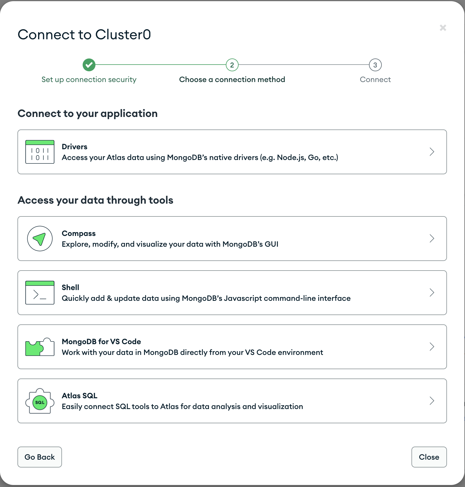

# <b>MONGODB DATABASE</b>


In the index.js file, we specified `process.env` to access environment variables, but we have not yet created this file. So we need to do that now.

Create a file in your `todo` directory and name it `.env`:

```
touch .env

vi .env
```

Add the connection string to access the database in it, just as below:

```
DB = 'mongodb+srv://<username>:<password>@<network-address>/<dbname>?retryWrites=true&w=majority'
```

However, to get the values, click on `overview` tab, then click on `connect`, and on the connect to cluster0 page, click on `drivers` tab:



On the next page, copy the connection string that looks like what we have above and replace the necessary portions:

Ensure to update `<username>`, `<password>`, `<network-address>`, and `<dbname>` according to your setup.

After adding the connection string into the `.env` file, we need to update the `index.js` file to reflect the use of `.env` so that Node.js can connect to the database. 

To do this, open `index.js` file with vim editor and delete the whole content with command `:%d`, afterward, replace the codes with the following lines of code:

```
const express = require('express');
const bodyParser = require('body-parser');
const mongoose = require('mongoose');
const routes = require('./routes/api');
const path = require('path');
require('dotenv').config();

const app = express();

const port = process.env.PORT || 5000;

//connect to the database
mongoose.connect(process.env.DB, { useNewUrlParser: true, useUnifiedTopology: true })
.then(() => console.log(`Database connected successfully`))
.catch(err => console.log(err));

//since mongoose promise is depreciated, we overide it with node's promise
mongoose.Promise = global.Promise;

app.use((req, res, next) => {
res.header("Access-Control-Allow-Origin", "\*");
res.header("Access-Control-Allow-Headers", "Origin, X-Requested-With, Content-Type, Accept");
next();
});

app.use(bodyParser.json());

app.use('/api', routes);

app.use((err, req, res, next) => {
console.log(err);
next();
});

app.listen(port, () => {
console.log(`Server running on port ${port}`)
});
```
Then save the file with command `:wq`.

Using environment variables to store information instead of writing connection strings directly inside the index.js application file is considered best practice. It is more secure to separate configuration and secret data from the application.

Start your server using the command:

```
node index.js
```

You shoud see a message as follows:

```
Server running on port 5000
Database connected successfully
```

With this, we have successfully configured our backend. Now we are going to test it.

## <b>Testing Backend Code without Frontend using RESTful API </b>

So far we have written the backend part of our `To-Do` application, and configured a database, but we do not have a frontend UI yet. We need ReactJS code to achieve that. But during development, we will need a way to test our code using `RESTful API`. Therefore, we will need to make use of some API development client to test our code.

In this project, we will use [Postman](https://www.postman.com/) to test our API. Click Install Postman to download and install postman on your machine.

Click HERE to learn how perform CRUD operartions on Postman

You should test all the API endpoints and make sure they are working. For the endpoints that require body, you should send JSON back with the necessary fields since it’s what we setup in our code.

Now open your Postman, create a POST request to the API http://:5000/api/todos. This request sends a new task to our To-Do list so the application could store it in the database.

Note: make sure your set header key Content-Type as application/json


