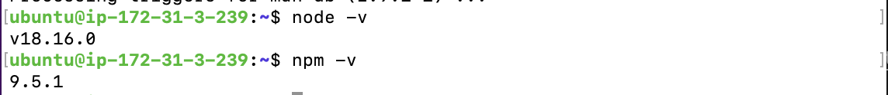
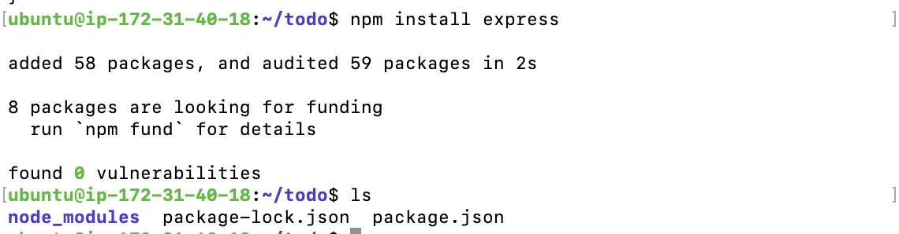
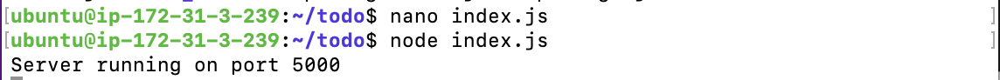
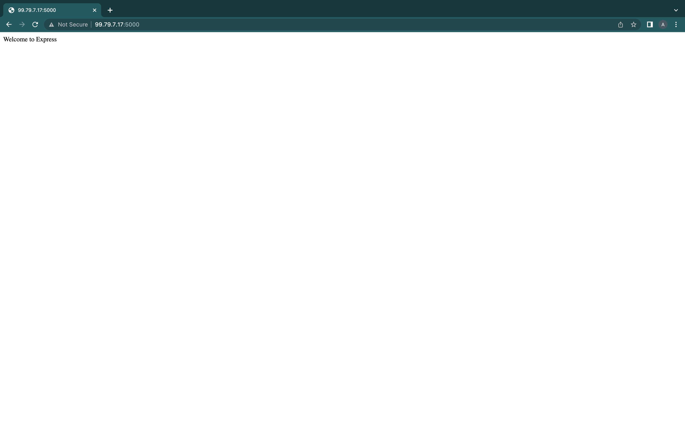

# <b>Steps taken for the project's implementation</b>

## <b>1. Launching a Linux Instance On AWS:</b>
   Just like in the previous projects, we will be using an AWS Ubuntu VM for this project. If you have an instance running already you can stop it to save available free hours so that you can spin up another one. 

   Remember that you can have multiple instances under the free tier account.

   <br>

## <b>2. Setting up and Configuring the Backend:</b>
   This will be splitted into two: <br>
   A. Installation of NodeJs and NPM and <br>
   B. Initializing Node packages in the project's directory.

   <br>

   ### <b>Installation of Node js and NPM:</b>

   Update and upgrade the Ubuntu repository
   ```
   sudo apt update && sudo apt  upgrade -y
   ```

   Get the location of Node.js software from Ubuntu repositories.

   ```
   curl -fsSL https://deb.nodesource.com/setup_18.x | sudo -E bash -
   ```

   Install Node.js on the server

   ```
   sudo apt-get install -y nodejs
   ```

   The commands above installs both NodeJs and NPM. `NPM` is a package manager for `Node` like `apt for Ubuntu`. It is used to install Node modules & packages and to manage dependency conflicts.

   To verify the successful installation of nodejs, use this command:

   ```
   node -v

   npm -v
   ```

   

   <br>

   ### <b>Initializing Node packages in the project's directory:</b>

   1. Create a new directory for the project by naming the folder `todo`.
   
   ```
   mkdir todo
   ```

   To confirm that the directory has been created, use the `ls` command. Note that you can add options to thhhe `ls` command to get more info about the directory you have just created. Options such as `-lih`, `-it`, `-l`.

   2. Move into the directory you just created and run `npm init` to initialize the project as shown below:
   
   ```
   cd todo

   npm init
   ```

   `npm init` will create a new file named `package.json`. This file will normally contain information about your application and the dependencies that it needs to run. Follow the prompts after running the command. You can press Enter several times to accept default values, then accept to write out the package.json file by typing yes.

   Run the `ls` command to confirm that you have `package.json` file created in the directory.


## <b>3. Installation of ExpressJs:</b>

   Remember that ExpressJs is a framework for NodeJs, therefore, a lot of things developers would have programmed is already taken care of out of the box. This then simplifies development, and abstracts a lot of low level details. For example, ExpressJs helps to define routes of your application based on HTTP methods and URLs.

   1. Install `ExpressJs` using the npm package manager as shown:
   
   ```
   npm install express
   ```

   This command further creates the `node-modules` directory and the `package-lock.json` files in the `todo project folder`.

   

   2. Create an `index.js` file as follows:
   
   ```
   touch index.js
   ```

   3. Install the `dotenv` module:
   
   ```
   npm install dotenv
   ```

   4. Open the `index.js` file with your preferred editor. I will be opening the nano editor with the `nano index.js` command, then copy the following lines of code into it:
   
   ```
    const express = require('express');
    require('dotenv').config();

    const app = express();

    const port = process.env.PORT || 5000;

    app.use((req, res, next) => {
    res.header("Access-Control-Allow-Origin", "\*");
    res.header("Access-Control-Allow-Headers", "Origin, X-Requested-With, Content-Type, Accept");
    next();
    });

    app.use((req, res, next) => {
    res.send('Welcome to Express');
    });

    app.listen(port, () => {
    console.log(`Server running on port ${port}`)
    });
   ```

   After pasting the code lines, exit the editor with `contol X`, then `Y` to say yes to save, and `Enter` to finally save and exit the editor (Please note that this is the command on a mac, you may find the equivalent on a windows machine if that's what you are using).

   Note that we have specified to use port 5000 in the code we pasted into the `index.js` file. This will be required later when we go on the browser.

   Now it is time to start our server to see if it works. Open another terminal to ssh into the server and navigate into the same directory as your index.js file and type:

   ```
   node index.js
   ```

   If every thing goes well, you should see `Server running on port 5000` in your terminal as shown:

   

   Recall that our Security Group created in project 1 allows all traffic, so we can open port 5000 of the IP address of the server on our browser like this:

   ```
   http://<PublicIP-or-PublicDNS>:5000
   ```

   You should have this:
   

   However, for security purpose, we can edit the Security Group to allow port 22, 80, and 5000 instead of allowing all traffic.

   Note that:

   You can get your server’s Public IP and public DNS name by:

   - Getting it on your AWS web console in EC2 details  section.
   - Running `curl -s http://169.254.169.254/latest/meta-data/public-ipv4` for Public IP address or
   - Running `curl -s http://169.254.169.254/latest/meta-data/public-hostname` for the Public DNS name.

## <b>4. Routes:</b> 

   There are three actions that our todo application needs to be able to do:

   1. Create a new task
   2. Display list of all tasks
   3. Delete a completed task
   
   Each task will be associated with some particular endpoint and will use different standard HTTP request methods which are: `POST, GET, and DELETE`.

   For each task, we need to create routes that will define various endpoints that the todo app will depend on. So let us create a folder called `routes` and move into it:

   ```
   mkdir routes

   cd routes
   ```

   Create a file named `api.js`:

   ```
   touch api.js
   ```

   Open the file, then, copy and paste the following codes lines in it:

   ```
   const express = require ('express');
   const router = express.Router();

   router.get('/todos', (req, res, next) => {

   });

   router.post('/todos', (req, res, next) => {

   });

   router.delete('/todos/:id', (req, res, next) => {

   })

   module.exports = router;
   ```

   The next step from here is the creation of models.

## <b>5. Models:</b>
   
   There's a brief description of what models are in this [file](models.md). To create a Schema and a model, install mongoose which is a Node.js package that makes working with mongodb easier.

   1. Change directory back to `todo` folder with `cd ..` command and install Mongoose.
   
   ```
   cd ..

   npm install mongoose
   ```

   2. Create a new folder called `models`, change into the directory and create a file called `todo.js` in the new directory:
   
   ```
   mkdir models && cd models && touch todo.js
   ```

   3. Open the `todo.js` file that you created in the `models` directory above and paste this lines of code in it:
   
   ```
    const mongoose = require('mongoose');
    const Schema = mongoose.Schema;

    //create schema for todo
    const TodoSchema = new Schema({
    action: {
    type: String,
    required: [true, 'The todo text field is required']
    }
    })

    //create model for todo
    const Todo = mongoose.model('todo', TodoSchema);

    module.exports = Todo;
   ```

   Now, we need to update our routes from the file `api.js` in `routes` directory to make use of the new model.

   In `Routes` directory, open `api.js` with vim editor, delete the code inside with `:%d` command and paste these codes below into it then save and exit.

   ```
   const express = require ('express');
   const router = express.Router();
   const Todo = require('../models/todo');

   router.get('/todos', (req, res, next) => {

   //this will return all the data, exposing only the id and action field to the client
   Todo.find({}, 'action')
   .then(data => res.json(data))
   .catch(next)
   });

   router.post('/todos', (req, res, next) => {
   if(req.body.action){
   Todo.create(req.body)
   .then(data => res.json(data))
   .catch(next)
   }else {
   res.json({
   error: "The input field is empty"
   })
   }
   });

   router.delete('/todos/:id', (req, res, next) => {
   Todo.findOneAndDelete({"_id": req.params.id})
   .then(data => res.json(data))
   .catch(next)
   })

   module.exports = router;
   ```


