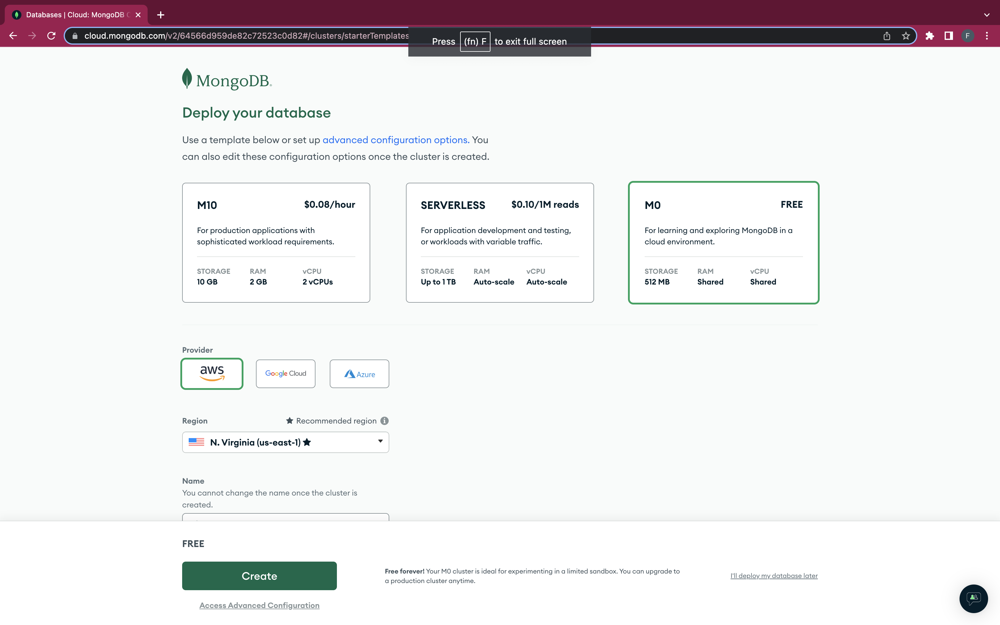
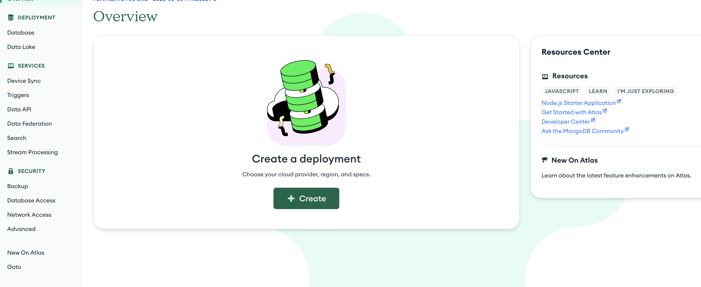
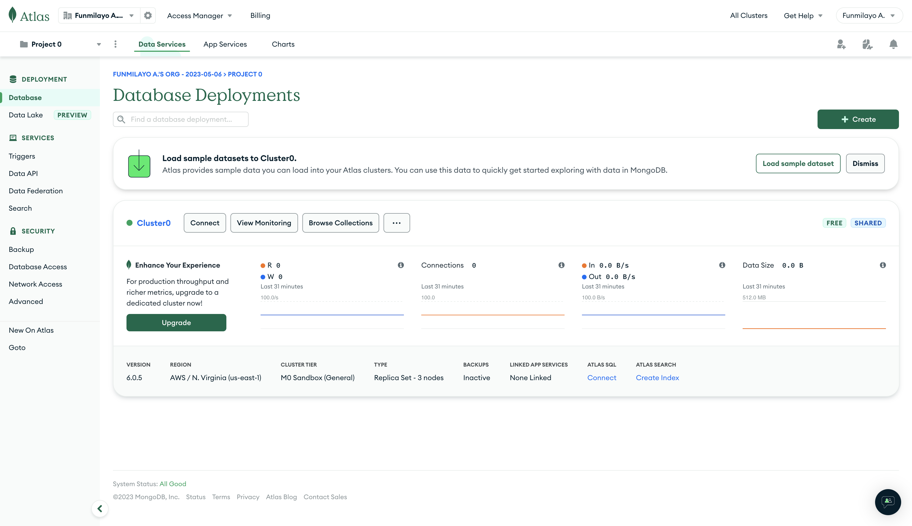
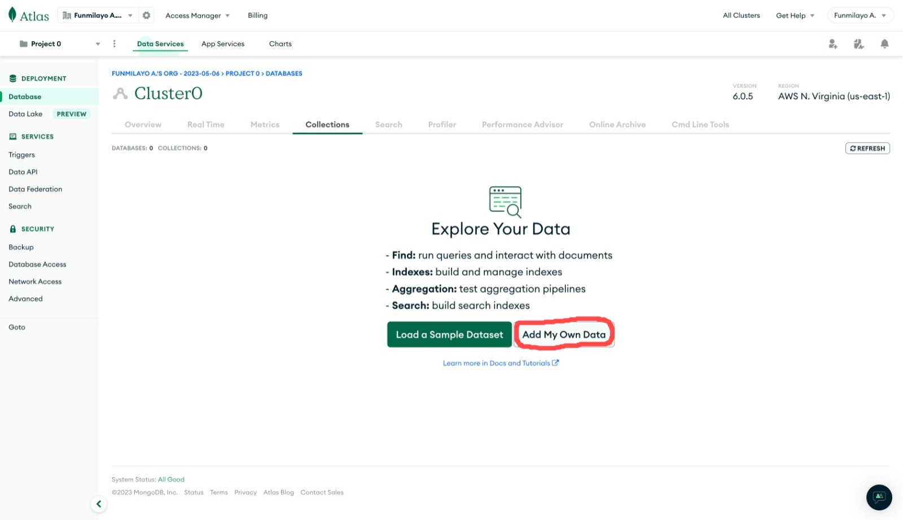
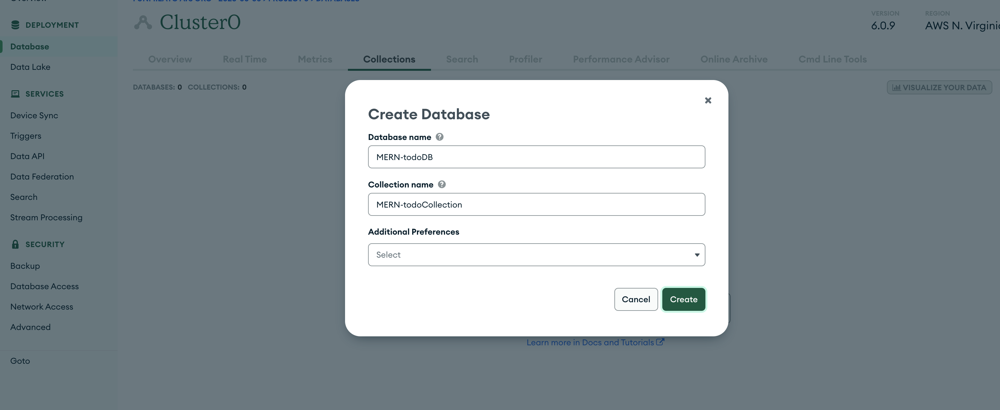
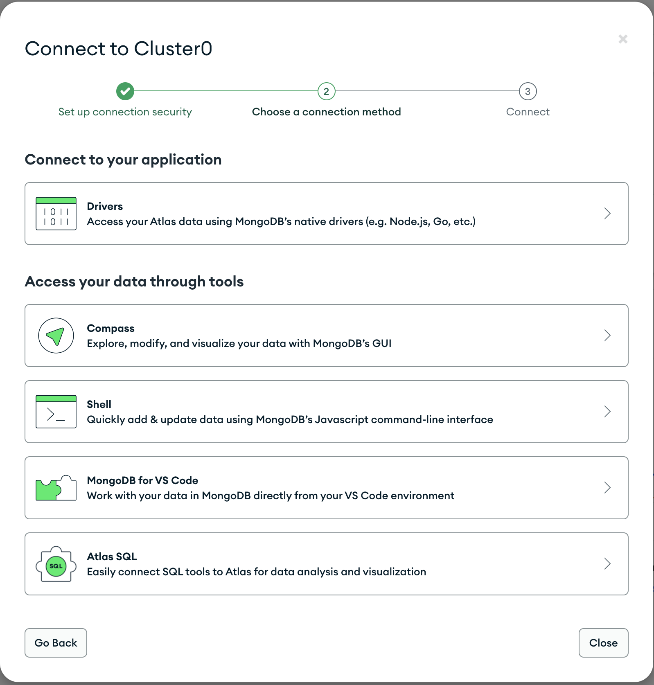
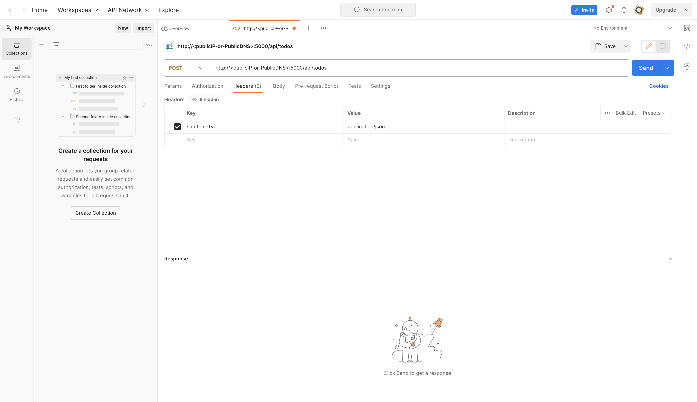
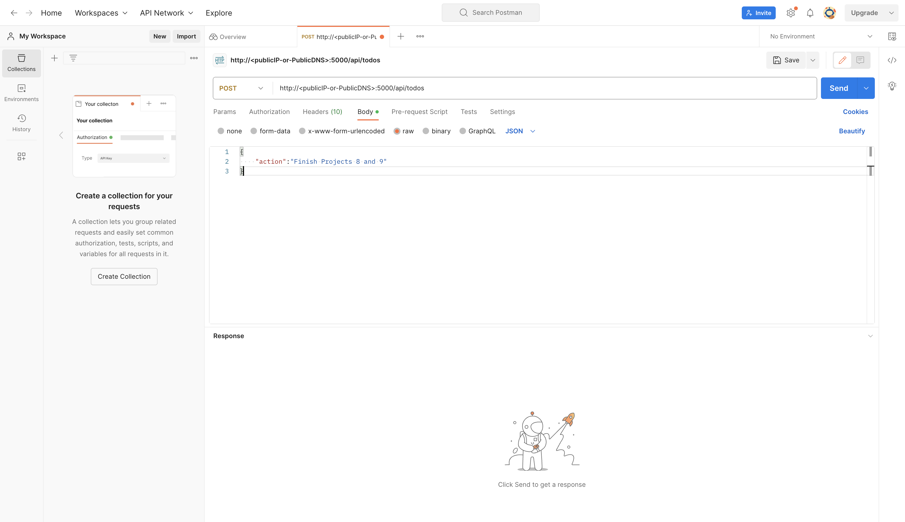
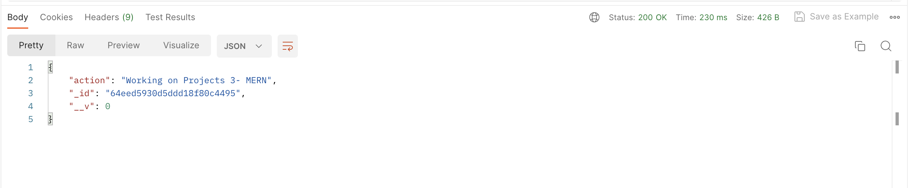
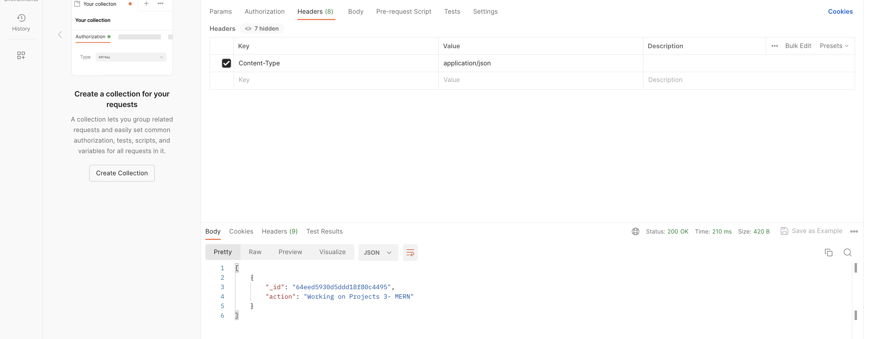

# <b>Steps taken for the project's implementation</b>- Continuation.

## <b>6. MongoDB Database:</b>
   We need a database where we will store our data. For this we will make use of `mLab`, a cloud-hosted MongoDB service, similar to `MongoDB Atlas`. mLab provides MongoDB database as a service solution [DBaaS](https://en.wikipedia.org/wiki/Cloud_database). 

   To make life easy, you will need to sign up for a shared clusters free account, which is ideal for our use case. Sign up [here](https://www.mongodb.com/atlas-signup-from-mlab). Follow the sign up process, select AWS as the cloud provider, and choose a region near you as shown below:
   

   However, I already have an account on the platform, so I started by creating a project, then, clicked on create a deployment.
   

   The deployment stage took me to the cluster creation page and remember to pick the free `M0` cluster:

   

   Click on Create, you will be directed to page to create a Database User, the authentication method, and the password. make sure to save the password somewhere because you will need it later. You will also input the Network Access which can also be edited on the `Network Access` tab on the Left-hand side of the overview page. 
   
   Then, you will allow access to the MongoDB database from anywhere, but it's usually not the best practice.

   Next, on the new page, Create a MongoDB database and collection inside mLab by clicking on the `Browse collection` tab:

   

   This will take you to this page, then, click on `Add My Own Data`:

   

   On the next page, add a name for your DB and the collection as shown:

   

   Leave the `Additional preference` tab as it is and click on `Create`.

## <b>7. The Environment Variable, `.env` file creation:</b>

   In the index.js file, we specified `process.env` to access environment variables, but we have not yet created this file. So we need to do that now.

   Create a file called `.env` in the `todo` directory. We will have to paste the Database connection string into the `.env` file in this format:

   ```
   DB = 'mongodb+srv://<username>:<password>@<network-address>/<dbname>?retryWrites=true&w=majority'
   ```

### <b>To get the DB Connection String for `.env` file</b>

   On the Left-hand pane of the page, click on the `Database` tab, and then on `Connect`:

   

   On the resulting page, Click on the Drivers to access data using MongoDB's native Drivers.

   

   You will find the connection string there, copy it and replace the password part with the User's password you saved earlier on.

   Paste the complete string in the `.env` file.

## <b>8. Update the `index.js` file:</b>

   The next step is to update the `index.js` file to reflect the use of the environment variable set in the `.env` file so that Node.js can connect to the database.

   Simply delete existing content in the file, and update it with the entire code below:

   ```
   const express = require('express');
   const bodyParser = require('body-parser');
   const mongoose = require('mongoose');
   const routes = require('./routes/api');
   const path = require('path');
   require('dotenv').config();

   const app = express();

   const port = process.env.PORT || 5000;

   //connect to the database
   mongoose.connect(process.env.DB, { useNewUrlParser: true, useUnifiedTopology: true })
   .then(() => console.log(`Database connected successfully`))
   .catch(err => console.log(err));

   //since mongoose promise is depreciated, we overide it with node's promise
   mongoose.Promise = global.Promise;

   app.use((req, res, next) => {
   res.header("Access-Control-Allow-Origin", "\*");
   res.header("Access-Control-Allow-Headers", "Origin, X-Requested-With, Content-Type, Accept");
   next();
   });

   app.use(bodyParser.json());

   app.use('/api', routes);

   app.use((err, req, res, next) => {
   console.log(err);
   next();
   });

   app.listen(port, () => {
   console.log(`Server running on port ${port}`)
   });
   ```

   It's important to note that using environment variables to store information is considered more secure and best practice to separate configuration and secret data from the application, instead of writing connection strings directly inside the index.js application file.

   We can now start our NodeJs server as follows:

   ```
   node index.js
   ```

   And You should see a message `Database connected successfully` in addition to the `Server running on port 5000` message. This shows that our backend has been configured. Now we are going to test it. 

## <b>9. Testing the Backend Code without Frontend using RESTful API:</b>

   So far in the project, we have written the backend part of our `todo` application, configured a database, but we have created the frontend yet. According to our stack, we will need a ReactJS code to achieve that. However, during development, we need a way to test our code and that is where the RESTful API applies. 
   
   At this stage, we will need to make use of some API development client to test our code. We will be using `Postman` to perform CRUD operations to test our APIs.

   We will test all the API endpoints and make sure they are working. For the endpoints that require body, we will send JSON back with the necessary fields since it’s what we setup in our code.

### <b>POST Operation on Postman.</b>
   - Open the Postman application and on the left side, click on `NEW`. On the resulting page, select the `HTTP` option since we are performing the requests over `HTTP` protocol.

   - create a POST request to the API `http://<publicIP-or-PublicDNS>:5000/api/todos`. This request sends a new task to our `todo` list so the application could store it in the database.
  
     Please, replace `<publicIP-or-PublicDNS>` with your server's IP address.

   - Then, set the header's `key` to `Content-Type` and the corresponding `value` as `application/json`.
  
     

   - For the Body, click on `raw` and then add this code lines:
     ```
     {
            "action":"Finish Projects 8 and 9"
     }
     ```

     

     You can add anything in your action's content. Then, click on `Send`. You should get a response like this:

     

### <b>GET Operation on Postman.</b>

   - Create another request, the `GET` request to the API on `http:<publicIP-or-PublicDNS>//:5000/api/todos` as the `POST` request done above. 
  
     This request retrieves all existing records from our `todo` application (that is, the backend requests these records from the database and sends it us back as a response to the `GET` request).

   - Also, create the header as before with the Key Value pairs.

   - Then, send. You should get back what was formerly posted in the previous section.
     

### <b>DELETE Operation on Postman.</b>


   With these three operations carried out successfully, you have been able to test the backend part of the `todo` application.

   You can:
   - Add new tasks to the list with the HTTP POST request.
   - Display a list of tasks with the HTTP GET request, and,
   - Delete an existing task from the list with the HTTP DELETE request.


