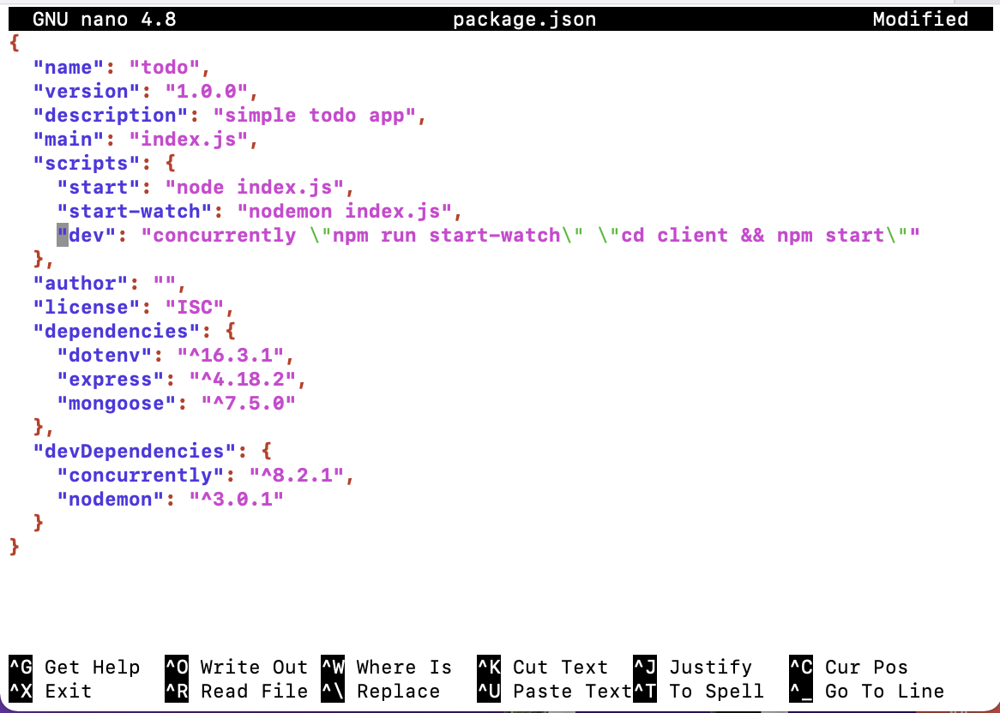
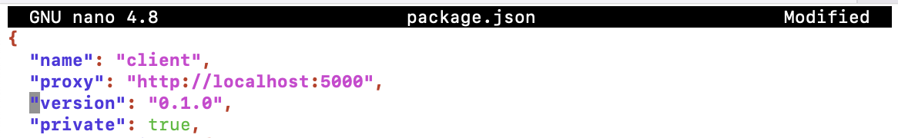
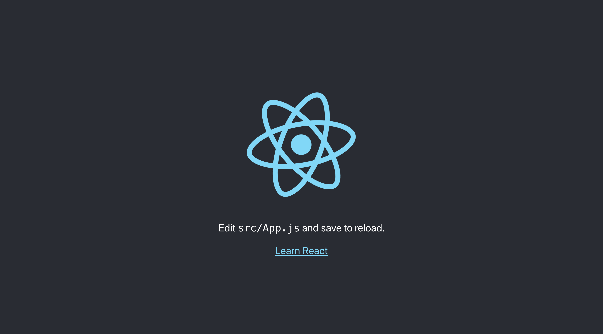
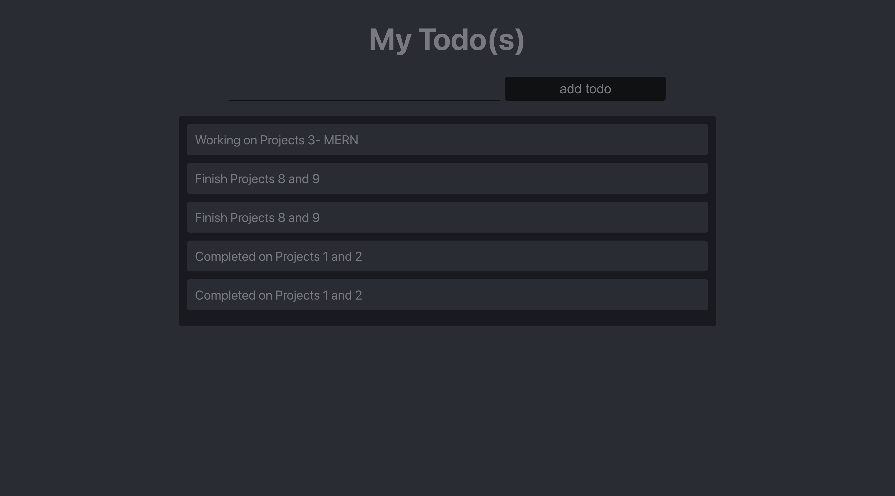

# <b>Steps taken for the project's implementation</b>- Continuation.

## <b>10. Frontend Creation:</b>
   Having set up the backend and API, it is time to create a user interface for a Web client (browser) to interact with the application via API. To start out with the frontend of the `todo` app, we will use the create-react-app command as follows:

   In the `todo` directory, run this command:
   ```
   npx create-react-app client
   ```

   At the prompt, enter `y` to continue the installation. The command will eventually create a directory called `client` in the todo app where all the react codes will be. 

### <b>Installing React Dependencies:</b>

   Before we go into the client directory, there are some ReactJs Dependencies that we need to install.

   1. Concurrently: used to run more than one command simultaneously from the same terminal. Run this command in the todo directory to install it:
   
      ```
      npm install concurrently --save-dev
      ```

   2. Nodemon: used to run and monitor the server. If there is any change in the server code, nodemon will restart it automatically and load the new changes.
   
      ```
      npm install nodemon --save-dev
      ```

   3. After successful installations of concurrently and nodemon, open the `package.json` file in `todo` folder and change the `script` part of the `JSON` file to:
      
      ```
      "scripts": {
      "start": "node index.js",
      "start-watch": "nodemon index.js",
      "dev": "concurrently \"npm run start-watch\" \"cd client && npm start\""
      },
      ```

      Then, the file becomes this:
      

      From:
      


### <b>Configure Proxy in package.json:</b>
   - Change into the `client` directory and open the `package.json` file.

      ```
      cd client && nano package.json
      ```

   - Add the key value pair, `"proxy":"http://localhost:5000"` in the <b>package.json</b> file. 
  
   

   The purpose of adding the proxy configuration is to easily access the application directly from the browser by calling the server url like this, `http://localhost:5000` rather than always including the entire path like this, `http://localhost:5000/api/todos`


### <b>Running the React App:</b>
   In the `todo` directory, do:

   ```
   npm run dev
   ```

   From the terminal, you will see an output like this:
   ```
   You can now view client in the browser.

   Local:            http://localhost:3000
   ```

   To view the app, on your web browser, use this URL:
   `http://<Your-Server's-PublicIP>:3000` or on the server's terminal, use the command:
   ```
   curl http://localhost:3000
   ```

   

   Please note that you will have to add port 3000 to the inbound rules of the Security Group of the Server to easily access the application from the Internet. 

### <b>Creating the React App Components:</b>

   One of the advantages of `React` is that it makes use of components, which are reusable and also makes code modular. For our `todo` app, there will be two stateful components and one stateless component. 
   
   - On a spare terminal, navigate to the `todo` directory, change directory into the `client`, then `src` folders and create a directory called `components`:
  
      ```
      cd client && ls

      cd src && mkdir components
      ```

   - Change into the components directory and create three files, `Input.js`, `ListTodo.js` and `Todo.js`:

      ```
      cd components/ && touch Input.js ListTodo.js Todo.js
      ```

   - Open the `Input.js` file and paste the following lines of code:

      ```
      import React, { Component } from 'react';
      import axios from 'axios';

      class Input extends Component {

      state = {
      action: ""
      }

      addTodo = () => {
      const task = {action: this.state.action}

        if(task.action && task.action.length > 0){
          axios.post('/api/todos', task)
            .then(res => {
              if(res.data){
                this.props.getTodos();
                this.setState({action: ""})
              }
            })
            .catch(err => console.log(err))
        }else {
          console.log('input field required')
        }

      }

      handleChange = (e) => {
      this.setState({
      action: e.target.value
      })
      }

      render() {
      let { action } = this.state;
      return (
      <div>
      <input type="text" onChange={this.handleChange} value={action} />
      <button onClick={this.addTodo}>add todo</button>
      </div>
      )
      }
      }

      export default Input
      ```

   To make use of Axios, a Promise-based HTTP client for the browser and node.js: 
   
   - Change directory into the `client` folder, and run:
   
      ```
      yarn add axios 
      
      or 
      
      npm install axios
      ```
 

   - Next, change directory into `src` then `components`, and open the `ListTodo.js` file. Paste the following into the file:
  
      ```
      import React from 'react';

      const ListTodo = ({ todos, deleteTodo }) => {

      return (
      <ul>
      {
      todos &&
      todos.length > 0 ?
      (
      todos.map(todo => {
      return (
      <li key={todo._id} onClick={() => deleteTodo(todo._id)}>{todo.action}</li>
      )
      })
      )
      :
      (
      <li>No todo(s) left</li>
      )
      }
      </ul>
      )
      }

      export default ListTodo
      ```

   - Then in the `Todo.js` file, paste the following codes:
  
      ```
      import React, {Component} from 'react';
      import axios from 'axios';

      import Input from './Input';
      import ListTodo from './ListTodo';

      class Todo extends Component {

      state = {
      todos: []
      }

      componentDidMount(){
      this.getTodos();
      }

      getTodos = () => {
      axios.get('/api/todos')
      .then(res => {
      if(res.data){
      this.setState({
      todos: res.data
      })
      }
      })
      .catch(err => console.log(err))
      }

      deleteTodo = (id) => {

            axios.delete(`/api/todos/${id}`)
              .then(res => {
                if(res.data){
                  this.getTodos()
                }
              })
              .catch(err => console.log(err))

      }

      render() {
      let { todos } = this.state;

            return(
              <div>
                <h1>My Todo(s)</h1>
                <Input getTodos={this.getTodos}/>
                <ListTodo todos={todos} deleteTodo={this.deleteTodo}/>
              </div>
            )

      }
      }

      export default Todo;
      ```

   - We need to make little adjustment to our React code. We will delete the logo's code in the `App.js` file and replace with another code. To achieve this, change directory into `src` and open the `App.js` file with the `vi` editor. Delete the file content with `:%d` command and Paste these new lines of code into it:
  
      ```
      import React from 'react';

      import Todo from './components/Todo';
      import './App.css';

      const App = () => {
      return (
      <div className="App">
      <Todo />
      </div>
      );
      }

      export default App;
      ```

   - Also in the `src` directory, open the `App.css` file with `vi` editor to delete the default code and paste the following code lines into it:

      ```
      .App {
      text-align: center;
      font-size: calc(10px + 2vmin);
      width: 60%;
      margin-left: auto;
      margin-right: auto;
      }

      input {
      height: 40px;
      width: 50%;
      border: none;
      border-bottom: 2px #101113 solid;
      background: none;
      font-size: 1.5rem;
      color: #787a80;
      }

      input:focus {
      outline: none;
      }

      button {
      width: 25%;
      height: 45px;
      border: none;
      margin-left: 10px;
      font-size: 25px;
      background: #101113;
      border-radius: 5px;
      color: #787a80;
      cursor: pointer;
      }

      button:focus {
      outline: none;
      }

      ul {
      list-style: none;
      text-align: left;
      padding: 15px;
      background: #171a1f;
      border-radius: 5px;
      }

      li {
      padding: 15px;
      font-size: 1.5rem;
      margin-bottom: 15px;
      background: #282c34;
      border-radius: 5px;
      overflow-wrap: break-word;
      cursor: pointer;
      }

      @media only screen and (min-width: 300px) {
      .App {
      width: 80%;
      }

      input {
      width: 100%
      }

      button {
      width: 100%;
      margin-top: 15px;
      margin-left: 0;
      }
      }

      @media only screen and (min-width: 640px) {
      .App {
      width: 60%;
      }

      input {
      width: 50%;
      }

      button {
      width: 30%;
      margin-left: 10px;
      margin-top: 0;
      }
      }
      ```

   - In the `src` directory, open the `index.css` file with `vi` editor to delete the default code and paste the following code lines into it:

      ```
      body {
      margin: 0;
      padding: 0;
      font-family: -apple-system, BlinkMacSystemFont, "Segoe UI", "Roboto", "Oxygen",
      "Ubuntu", "Cantarell", "Fira Sans", "Droid Sans", "Helvetica Neue",
      sans-serif;
      -webkit-font-smoothing: antialiased;
      -moz-osx-font-smoothing: grayscale;
      box-sizing: border-box;
      background-color: #282c34;
      color: #787a80;
      }

      code {
      font-family: source-code-pro, Menlo, Monaco, Consolas, "Courier New",
      monospace;
      }
      ```

   - Lastly, to verify all our configurations, go to the webpage and visit the URL `http://<Public-IP-address>:3000`, you should get a page similar to this if all went well:
  
      


And with this, we have successfully implemented Project #3 by creating a simple `todo` app and deploying it to a `MERN` stack. 

In this project, you have written a frontend application using React.js that communicates with a backend application written using Expressjs. You also created a MongoDB Backend for storing tasks in a database.


    
      


      


      


