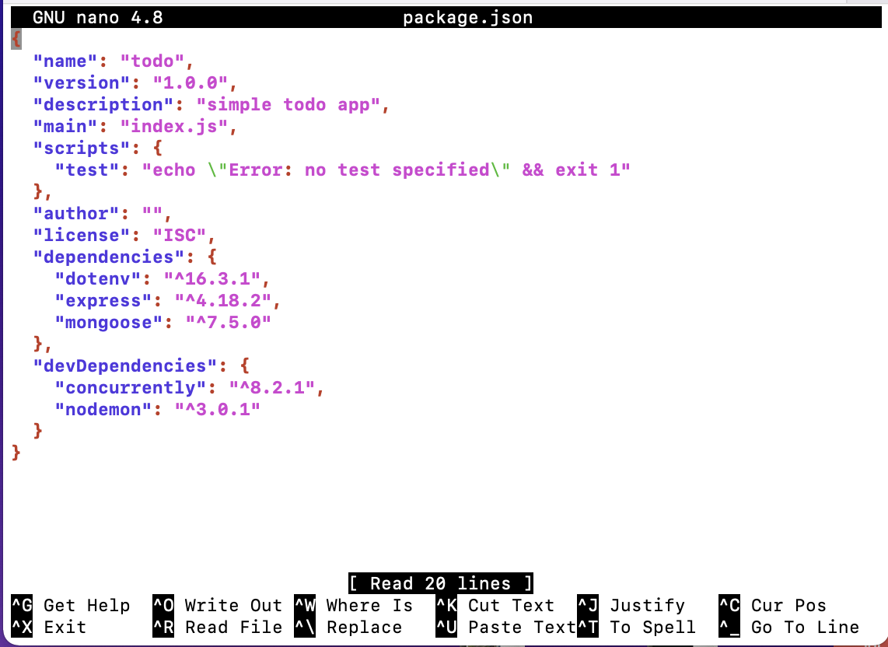

# <b>Steps taken for the project's implementation</b>- Continuation.

## <b>10. Frontend Creation:</b>
   Having set up the backend and API, it is time to create a user interface for a Web client (browser) to interact with the application via API. To start out with the frontend of the `todo` app, we will use the create-react-app command as follows:

   In the `todo` directory, run this command:
   ```
   npx create-react-app client
   ```

   At the prompt, enter `y` to continue the installation. The command will eventually create a directory called `client` in the todo app where all the react codes will be. 

### <b>Installing React Dependencies:</b>

   Before we go into the client directory, there are some ReactJs Dependencies that we need to install.

   1. Concurrently: used to run more than one command simultaneously from the same terminal. Run this command in the todo directory to install it:
   
      ```
      npm install concurrently --save-dev
      ```

   2. Nodemon: used to run and monitor the server. If there is any change in the server code, nodemon will restart it automatically and load the new changes.
   
      ```
      npm install nodemon --save-dev
      ```

   3. After successful installations of concurrently and nodemon, open the `package.json` file in `todo` folder and change the `script` part of the `JSON` file to:
      
      ```
      "scripts": {
      "start": "node index.js",
      "start-watch": "nodemon index.js",
      "dev": "concurrently \"npm run start-watch\" \"cd client && npm start\""
      },
      ```

      Then, the file becomes this:
      

      From:
      


### <b>Configure Proxy in package.json:</b>
   - Change into the `client` directory and open the `package.json` file.

      ```
      cd client && nano package.json
      ```

   - Add the key value pair, `"proxy":"http://localhost:5000"` in the <b>package.json</b> file. 
  
   

   The purpose of adding the proxy configuration is to easily access the application directly from the browser by calling the server url like this, `http://localhost:5000` rather than always including the entire path like this, `http://localhost:5000/api/todos`


### <b>Running the React App:</b>
   In the `todo` directory, do:

   ```
   npm run dev
   ```

   From the terminal, you will see an output like this:
   ```
   You can now view client in the browser.

   Local:            http://localhost:3000
   ```

   To view the app, on your web browser, use this URL:
   `http://<Your-Server's-PublicIP>:3000` or on the server's terminal, use the command:
   ```
   curl http://localhost:3000
   ```

   Please note that you will have to add port 3000 to the inbound rules of the Security Group of the Server to easily access the application from the Internet. 

### <b>Creating the React App Components:</b>


      


